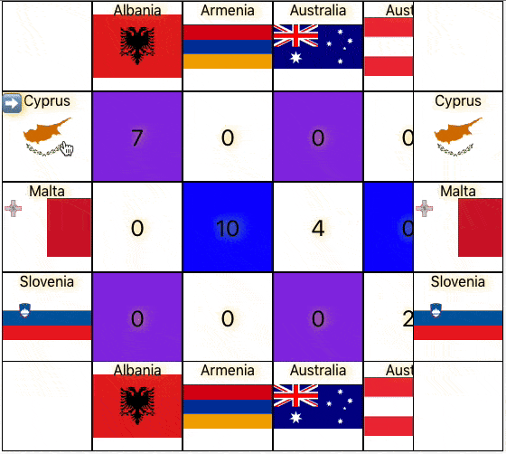

## Sticky Eurovision: Technology Demonstrator for css sticky, dom virtualization, and react hooks.

Contains 4 different implementations of a scrollable table showing Eurovision 2019 Grand Final results.

Some of them including "Frozen" (spreadsheet-like) header-footer-starter-ender, implemented without javascript, but CSS sticky only!

I hope the different implementations will help understand better the topics separately. (As they did for me)

The most interesting one is [WithReactWindowAndSticky](./src/implementations/WithReactWindowAndSticky/WithReactWindowAndSticky.ts), which is a sophisticated combination of react-window (well a slightly patched version ATM) CSS grid layout, and CSS sticky.

There is no React magic - It can be implemented in a similar manner with any FW/vanilla code.

I chose hard-coded cell size of 100x100 cell for simplicity,
But i don't see any blocker to implement it with even variable rows/columns, and multiple frozen rows/columns.  
I will probably add a variant with ability to remove rows/columns.

## Why CSS sticky is a thing?

**It's our only!**(?\*) api to tell the browser that the scrolling and positioning of an element should be synced in a way:

- The browser can optimize it in the rendering pipeline
- Scrolling happens in the compositor (or close to it in the pipeline),  
  And only _after_ the scroll have happened, scroll handlers are called. that's why syncing scrollable areas using js always feels bad. Even if your scroll handler is super slim.
- Minimal code - When you figure out the layout - you just add it

[*] Until [houdini animationworklet](https://drafts.css-houdini.org/css-animationworklet/) are available and widely supported

### Other implementations / Does all the other so bad?(No!) (This section needs its own article)

It's all about tradeoffs, legacy, and flexibility.
Other similar table/spreadsheet-like grids are using a combination of nested/multiple scrollable areas, and scrolling them together.
To avoid the sync lag due to the late-scroll-event, you will see some of them disabling native scroll, or scrolling empty big surface listening to the events, and scrolling the actually content using JS. It is an overhead, and you might loose some of the native scrolling behavior like scrollsnap, momentum, overscroll, and there's many places to make mistakes and kill performances and UX.
BUT you get endless flexibility layout-wise!.

Some notable examples:

- https://www.ag-grid.com/example.php#/
- Google spreadsheet (the visual stuff are rendered into canvas but they hold also DOM cells for events!)
- https://bvaughn.github.io/react-virtualized/#/components/ScrollSync

## What the future holds:

- https://drafts.css-houdini.org/css-animationworklet/ houdini is not practical yet, but its good to read about it.
- https://developer.mozilla.org/en-US/docs/Web/CSS/contain to be widely supported.

### And a personal note: I have failed several times before

The code might look now simple and clear, But it took me many mistakes, frustrations and iterations to bring it to this state, But i'm sure it can get even better!

# I will be happy for any feedback!

## Browsers support (Should be, and somewhat tested on):

- Edge >= 16
- And all rest :)

Scrollsnap included ;)  
PS: i'm using yarn here.

---

This project was bootstrapped with [Create React App](https://github.com/facebook/create-react-app).

## Available Scripts

In the project directory, you can run:

### `npm start`

Runs the app in the development mode. 
Open [http://localhost:3000](http://localhost:3000) to view it in the browser.

The page will reload if you make edits. 
You will also see any lint errors in the console.

### `npm test`

Launches the test runner in the interactive watch mode. 
See the section about [running tests](https://facebook.github.io/create-react-app/docs/running-tests) for more information.

### `npm run build`

Builds the app for production to the `build` folder. 
It correctly bundles React in production mode and optimizes the build for the best performance.

The build is minified and the filenames include the hashes. 
Your app is ready to be deployed!

See the section about [deployment](https://facebook.github.io/create-react-app/docs/deployment) for more information.

### `npm run eject`

**Note: this is a one-way operation. Once you `eject`, you can’t go back!**

If you aren’t satisfied with the build tool and configuration choices, you can `eject` at any time. This command will remove the single build dependency from your project.

Instead, it will copy all the configuration files and the transitive dependencies (Webpack, Babel, ESLint, etc) right into your project so you have full control over them. All of the commands except `eject` will still work, but they will point to the copied scripts so you can tweak them. At this point you’re on your own.

You don’t have to ever use `eject`. The curated feature set is suitable for small and middle deployments, and you shouldn’t feel obligated to use this feature. However we understand that this tool wouldn’t be useful if you couldn’t customize it when you are ready for it.

## Learn More

You can learn more in the [Create React App documentation](https://facebook.github.io/create-react-app/docs/getting-started).

To learn React, check out the [React documentation](https://reactjs.org/).
